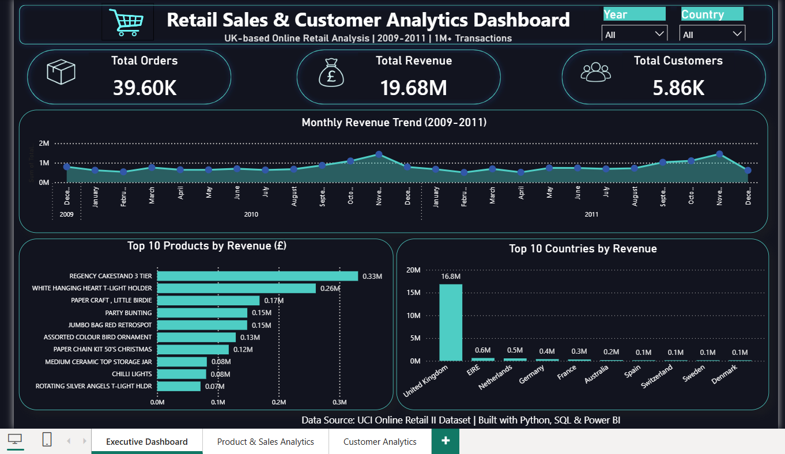
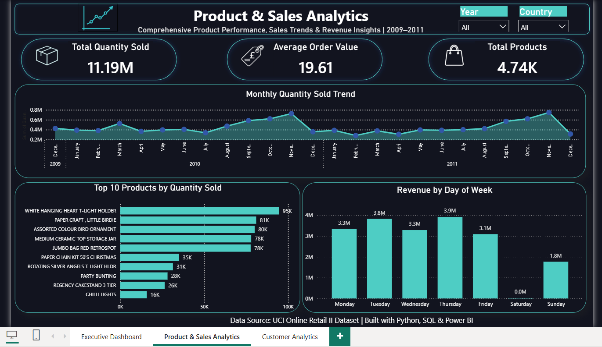
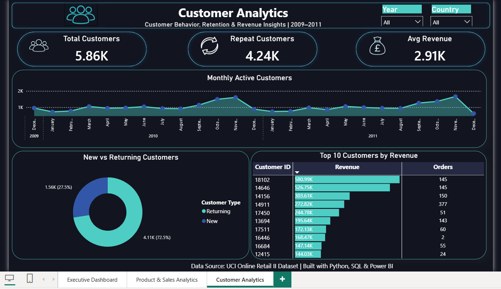

# 📊 Retail Sales & Customer Analytics Dashboard

End-to-end retail sales and customer analytics project using **Python, SQL, and Power BI**, focused on identifying revenue trends, product performance, and customer retention patterns through an interactive multi-page dashboard.

## 📌 Problem Statement

Understanding sales performance and customer behavior is critical for retail growth. This project analyzes over 1 million UK retail transactions to identify **top-performing products and markets**, uncover **seasonal revenue trends**, and surface **customer retention patterns**, delivered through an interactive Power BI dashboard.

## 📂 Dataset

**UCI Online Retail II Dataset**
[Kaggle Dataset](https://www.kaggle.com/datasets/mashlyn/online-retail-ii-uci)

The dataset contains over **1 million transactions** from a UK-based online retailer between 2009–2011, including invoice details, product descriptions, quantities, prices, and customer/country information.

## 🛠️ Tools & Skills

- **Python** — pandas, data cleaning
- **SQL** — SQLite, business-question querying (via Python)
- **Power BI** — interactive multi-page dashboard, DAX, KPI analysis, cross-page slicers
- **Data Analysis** — data cleaning, exploratory analysis, customer segmentation

## 📁 Project Structure

```text
retail-sales-analytics-dashboard/
│
├── Screenshots/
│   ├── Page1_Executive_Dashboard.png
│   ├── Page2_Product_Sales_Analytics.png
│   └── Page3_Customer_Analytics.png
│
├── analysis.ipynb
├── retail_sales_dashboard.pbix
├── .gitignore
└── README.md
```

## 🧹 Data Cleaning

The raw dataset was cleaned and prepared for analysis using Python.

Key preprocessing steps included:

- Removed cancelled orders (Invoice numbers starting with 'C').
- Dropped records with missing product descriptions.
- Removed exact duplicate transaction rows.
- Removed invalid records with non-positive quantity or price values after handling cancelled transactions.
- Excluded non-product entries such as postage, adjustments, and manual charges.
- Engineered new columns (TotalSales, Year, Month, Weekday, Hour) to support time-based analysis.
- Loaded the cleaned data into a SQLite database for SQL-based analysis.

**Final dataset**: 1,003,520 clean transaction records (from 1,067,371 raw records)

## 📊 Power BI Dashboard

The dashboard consists of **three pages**, following a business-focused analytical flow:

**Overview → Product Performance → Customer Behavior**

### Page 1 — Executive Dashboard

- Total orders, revenue, and customers
- Monthly revenue trend (2009–2011)
- Top 10 products by revenue
- Top 10 countries by revenue



### Page 2 — Product & Sales Analytics

- Total quantity sold and average order value
- Monthly quantity sold trend
- Top products by quantity sold
- Revenue by day of week



### Page 3 — Customer Analytics

- Total customers and repeat customer count
- Average revenue per customer
- Monthly active customers trend
- New vs. returning customer split
- Top 10 customers by revenue



All pages include synchronized **Year** and **Country** slicers for cross-page interactive filtering.

## 🔑 Key Insights

- **Revenue shows a strong seasonal spike in November** (both 2010 and 2011), consistent with holiday-driven demand.
- **The United Kingdom accounts for the large majority of total revenue**, with EIRE and Netherlands as the next largest markets.
- **72% of customers made repeat purchases** during the analysis period, indicating strong customer retention.
- **A small segment of bulk-buyer customers generate disproportionately high revenue** from very few orders.
- **Thursday and Tuesday show the highest revenue by day of week**, while Saturday shows minimal activity.

## 💡 Business Recommendations

- **Prepare inventory and staffing for the November seasonal peak** to avoid stockouts during high-demand periods.
- **Develop loyalty and retention programs** to strengthen the already-strong repeat customer base.
- **Identify and prioritize bulk-buyer/wholesale customers** for dedicated account management.
- **Explore expansion opportunities in EIRE and Netherlands**, the next-largest markets after the UK.
- **Align staffing and promotions with weekday demand patterns**, given the lower activity observed on weekends.

## 🚀 How to Run

### Clone the repository

```bash
git clone https://github.com/Krishnapriya-S-G/retail-sales-analytics-dashboard.git
cd retail-sales-analytics-dashboard
```

### Set up the Python environment

```bash
python -m venv venv
venv\Scripts\activate
pip install pandas numpy jupyter
```

### Run the notebook

```bash
jupyter notebook analysis.ipynb
```

**Note**: Raw and cleaned data files are not included in this repository due to size limits. Download the dataset from the Kaggle link above to reproduce the analysis.

### Power BI

Open:

```text
retail_sales_dashboard.pbix
```

using **Power BI Desktop** to explore the interactive dashboard.

## 👤 Author

**Krishnapriya S G**
Aspiring Data Analyst | [LinkedIn](https://www.linkedin.com/in/krishnapriya-s-g)